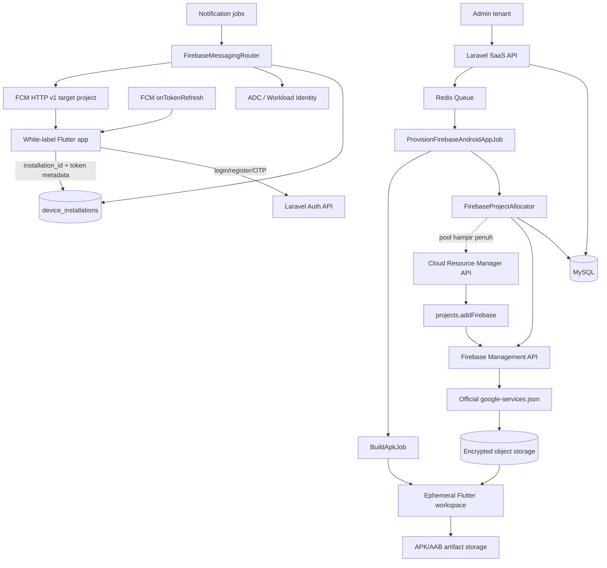
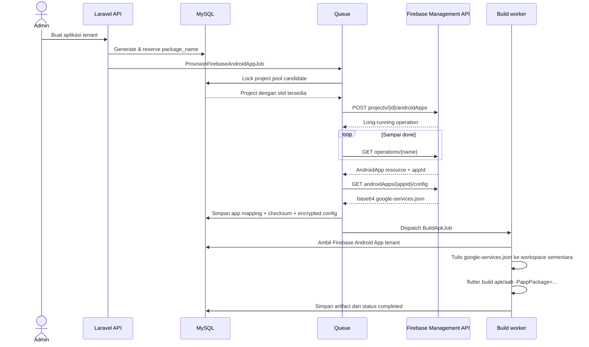

# Enterprise Firebase Architecture for White-label Flutter

## Keputusan arsitektur

Gunakan **dynamic provisioning + Firebase project pool**, dengan dua kelas:

| Kelas | Penempatan | Cocok untuk |
|---|---|---|
| Dedicated | 1 Firebase project per tenant/brand | Premium, Analytics, Auth, compliance, isolasi quota |
| Shared FCM-only | 20-25 Android apps per Firebase project | Tenant standar yang hanya memakai FCM |

Firebase membatasi total Firebase App (Android, Apple, Web) dalam satu project
menjadi 30. Jangan memakai 30 sebagai target operasional. Gunakan `soft_limit=25`
atau `soft_limit=20` agar tersedia ruang untuk retry, staging, dan app tambahan.

`google-services.json` tidak boleh dibuat dengan mengganti package name pada
template. Android App harus benar-benar dibuat melalui Firebase Management API,
lalu konfigurasi resminya diambil lewat `androidApps.getConfig`.

## Arsitektur



## Alur provisioning dan build



## Skema database

Gunakan tabel tenant yang sudah ada bila `admin_users` memang merupakan tenant.
Di bawah ini nama generik `tenants`; foreign key dapat diarahkan ke
`admin_users.id`.
    
```php
Schema::create('firebase_projects', function (Blueprint $table) {
    $table->id();
    $table->string('google_project_id')->unique();
    $table->string('google_project_number')->nullable()->unique();
    $table->string('display_name');
    $table->enum('allocation_mode', ['shared', 'dedicated'])->default('shared');
    $table->enum('status', [
        'provisioning', 'active', 'draining', 'full', 'error', 'disabled'
    ])->default('provisioning');
    $table->unsignedSmallInteger('soft_app_limit')->default(25);
    $table->unsignedSmallInteger('hard_app_limit')->default(30);
    $table->unsignedSmallInteger('registered_app_count')->default(0);
    $table->unsignedSmallInteger('reserved_app_count')->default(0);
    $table->string('credential_reference')->nullable();
    $table->text('last_error')->nullable();
    $table->timestamp('last_reconciled_at')->nullable();
    $table->timestamps();

    $table->index(['status', 'allocation_mode', 'registered_app_count']);
});

Schema::create('firebase_android_apps', function (Blueprint $table) {
    $table->id();
    $table->foreignId('tenant_id')->constrained()->cascadeOnDelete();
    $table->foreignId('firebase_project_id')
        ->constrained('firebase_projects')->restrictOnDelete();
    $table->string('package_name')->unique();
    $table->string('display_name');
    $table->string('firebase_app_id')->nullable()->unique();
    $table->string('firebase_resource_name')->nullable()->unique();
    $table->enum('status', [
        'reserved', 'provisioning', 'active', 'failed', 'retired'
    ])->default('reserved');
    $table->longText('google_services_json_encrypted')->nullable();
    $table->char('config_sha256', 64)->nullable();
    $table->string('operation_name')->nullable();
    $table->unsignedInteger('provision_attempts')->default(0);
    $table->text('last_error')->nullable();
    $table->timestamp('provisioned_at')->nullable();
    $table->timestamps();

    $table->unique(['tenant_id', 'package_name']);
    $table->index(['firebase_project_id', 'status']);
});

Schema::create('tenant_applications', function (Blueprint $table) {
    $table->id();
    $table->foreignId('tenant_id')->constrained()->cascadeOnDelete();
    $table->foreignId('firebase_android_app_id')
        ->nullable()->constrained('firebase_android_apps')->nullOnDelete();
    $table->string('app_type', 40);
    $table->string('package_name')->unique();
    $table->string('app_name');
    $table->enum('status', [
        'draft', 'provisioning', 'ready_to_build', 'building', 'active', 'failed'
    ])->default('draft');
    $table->string('version_name')->default('1.0.0');
    $table->unsignedBigInteger('version_code')->default(1);
    $table->timestamps();

    $table->unique(['tenant_id', 'app_type']);
});

Schema::create('device_installations', function (Blueprint $table) {
    $table->id();
    $table->foreignId('tenant_id')->constrained()->cascadeOnDelete();
    $table->foreignId('firebase_android_app_id')
        ->constrained('firebase_android_apps')->cascadeOnDelete();
    $table->foreignId('user_id')->nullable()->constrained()->nullOnDelete();
    $table->string('installation_id', 80);
    $table->text('fcm_token')->nullable();
    $table->char('fcm_token_hash', 64)->nullable();
    $table->string('package_name');
    $table->string('firebase_app_id');
    $table->string('platform', 20)->default('android');
    $table->string('app_version')->nullable();
    $table->string('app_build_number')->nullable();
    $table->enum('status', ['active', 'stale', 'invalid', 'revoked'])
        ->default('active');
    $table->timestamp('token_refreshed_at')->nullable();
    $table->timestamp('last_seen_at')->nullable();
    $table->timestamp('last_delivery_at')->nullable();
    $table->timestamp('invalidated_at')->nullable();
    $table->timestamps();

    $table->unique(
        ['firebase_android_app_id', 'installation_id'],
        'device_installation_app_unique'
    );
    $table->unique('fcm_token_hash');
    $table->index(['user_id', 'status']);
    $table->index(['tenant_id', 'status']);
});
```

Jangan gunakan token FCM sebagai identitas keamanan perangkat. Token dapat
berubah saat reinstall, clear data, restore, atau refresh oleh FCM. OTP
"perangkat baru" harus membandingkan `installation_id` atau device credential
terpisah; `fcm_token` hanya alamat pengiriman push.

## Konfigurasi Laravel

```php
// config/services.php
'firebase_management' => [
    'credentials' => env('GOOGLE_APPLICATION_CREDENTIALS'),
    'soft_app_limit' => (int) env('FIREBASE_POOL_SOFT_LIMIT', 25),
    'poll_seconds' => (int) env('FIREBASE_OPERATION_POLL_SECONDS', 2),
    'poll_attempts' => (int) env('FIREBASE_OPERATION_POLL_ATTEMPTS', 30),
],
```

Gunakan Application Default Credentials atau Workload Identity Federation.
Hindari membuat dan menyimpan satu private key service account per tenant.
Service account provisioning pusat diberi role minimum pada organization/folder
dan project pool. Kredensial pengirim FCM pusat diberi izin mengirim pada target
project.

## Access token Google

Paket `kreait/firebase-php` membawa dependency Google Auth pada instalasi normal.

```php
namespace App\Services\Firebase;

use Google\Auth\ApplicationDefaultCredentials;

final class GoogleAccessTokenProvider
{
    public function token(): string
    {
        $credentials = ApplicationDefaultCredentials::getCredentials(
            ['https://www.googleapis.com/auth/cloud-platform']
        );

        $token = $credentials->fetchAuthToken();

        if (empty($token['access_token'])) {
            throw new \RuntimeException('Google access token tidak tersedia.');
        }

        return $token['access_token'];
    }
}
```

## Firebase Management API service

```php
namespace App\Services\Firebase;

use Illuminate\Http\Client\PendingRequest;
use Illuminate\Support\Facades\Http;

final class FirebaseManagementClient
{
    public function __construct(
        private GoogleAccessTokenProvider $tokens
    ) {}

    private function http(): PendingRequest
    {
        return Http::baseUrl('https://firebase.googleapis.com/v1beta1')
            ->acceptJson()
            ->withToken($this->tokens->token())
            ->retry(4, 1000, throw: false)
            ->timeout(30);
    }

    public function createAndroidApp(
        string $projectId,
        string $packageName,
        string $displayName
    ): array {
        return $this->http()
            ->post("projects/{$projectId}/androidApps", [
                'packageName' => $packageName,
                'displayName' => $displayName,
            ])
            ->throw()
            ->json();
    }

    public function waitForOperation(string $operationName): array
    {
        $attempts = config('services.firebase_management.poll_attempts', 30);

        for ($attempt = 1; $attempt <= $attempts; $attempt++) {
            $operation = $this->http()->get($operationName)->throw()->json();

            if (($operation['done'] ?? false) === true) {
                if (isset($operation['error'])) {
                    throw new \RuntimeException(json_encode($operation['error']));
                }

                return $operation['response'];
            }

            sleep(config('services.firebase_management.poll_seconds', 2));
        }

        throw new \RuntimeException("Operation timeout: {$operationName}");
    }

    public function getAndroidConfig(string $resourceName): string
    {
        $response = $this->http()
            ->get("{$resourceName}/config")
            ->throw()
            ->json();

        $json = base64_decode($response['configFileContents'] ?? '', true);

        if ($json === false || json_decode($json, true) === null) {
            throw new \RuntimeException('Firebase Android config tidak valid.');
        }

        return $json;
    }

    public function listAndroidApps(string $projectId): array
    {
        return $this->http()
            ->get("projects/{$projectId}/androidApps", ['pageSize' => 100])
            ->throw()
            ->json('apps', []);
    }
}
```

## Allocator dengan lock

```php
final class FirebaseProjectAllocator
{
    public function reserveSharedProject(): FirebaseProject
    {
        return DB::transaction(function () {
            $project = FirebaseProject::query()
                ->where('allocation_mode', 'shared')
                ->where('status', 'active')
                ->whereRaw(
                    '(registered_app_count + reserved_app_count) < soft_app_limit'
                )
                ->orderByRaw(
                    '(registered_app_count + reserved_app_count) ASC'
                )
                ->lockForUpdate()
                ->first();

            if (!$project) {
                ProvisionFirebasePoolProjectJob::dispatch();
                throw new NoFirebaseCapacityException(
                    'Tidak ada slot Firebase aktif. Project baru sedang dibuat.'
                );
            }

            $project->increment('reserved_app_count');

            return $project->fresh();
        }, 5);
    }
}
```

Reservation wajib dilepas bila provisioning gagal permanen. Setelah sukses,
kurangi `reserved_app_count` dan tambah `registered_app_count` dalam satu
transaksi.

## Provisioning service

```php
final class FirebaseAndroidAppProvisioner
{
    public function __construct(
        private FirebaseProjectAllocator $allocator,
        private FirebaseManagementClient $firebase,
    ) {}

    public function provision(FirebaseAndroidApp $app): FirebaseAndroidApp
    {
        if ($app->status === 'active') {
            return $app;
        }

        $project = $app->firebaseProject
            ?? $this->allocator->reserveSharedProject();

        $app->update([
            'firebase_project_id' => $project->id,
            'status' => 'provisioning',
            'provision_attempts' => DB::raw('provision_attempts + 1'),
        ]);

        try {
            $operation = $this->firebase->createAndroidApp(
                $project->google_project_id,
                $app->package_name,
                $app->display_name,
            );

            $app->update(['operation_name' => $operation['name']]);
            $firebaseApp = $this->firebase->waitForOperation($operation['name']);
            $configJson = $this->firebase->getAndroidConfig($firebaseApp['name']);

            DB::transaction(function () use (
                $app, $project, $firebaseApp, $configJson
            ) {
                $app->update([
                    'firebase_app_id' => $firebaseApp['appId'],
                    'firebase_resource_name' => $firebaseApp['name'],
                    'google_services_json_encrypted' => encrypt($configJson),
                    'config_sha256' => hash('sha256', $configJson),
                    'status' => 'active',
                    'provisioned_at' => now(),
                    'last_error' => null,
                ]);

                $project->decrement('reserved_app_count');
                $project->increment('registered_app_count');
            });

            return $app->fresh();
        } catch (\Throwable $e) {
            $app->update(['status' => 'failed', 'last_error' => $e->getMessage()]);

            if ($this->isCapacityError($e)) {
                $project->update(['status' => 'full']);
            }

            throw $e;
        }
    }

    private function isCapacityError(\Throwable $e): bool
    {
        return str_contains($e->getMessage(), 'maximum number of apps')
            || str_contains($e->getMessage(), 'RESOURCE_EXHAUSTED');
    }
}
```

Untuk idempotency, sebelum `createAndroidApp` pada retry, panggil
`listAndroidApps` dan cari `packageName` yang sama. Package name bersifat
immutable. Jika sudah ada, adopsi resource itu dan lanjutkan `getConfig`.

## Integrasi BuildApkJob

Hapus `writeGoogleServicesJson()` yang meracik placeholder. Ganti dengan config
hasil provisioning:

```php
private function writeGoogleServicesJson(
    string $buildDir,
    FirebaseAndroidApp $firebaseApp
): void {
    if ($firebaseApp->status !== 'active') {
        throw new \RuntimeException('Firebase Android App belum aktif.');
    }

    $json = decrypt($firebaseApp->google_services_json_encrypted);
    $decoded = json_decode($json, true, flags: JSON_THROW_ON_ERROR);
    $actualPackage = data_get(
        $decoded,
        'client.0.client_info.android_client_info.package_name'
    );

    if ($actualPackage !== $firebaseApp->package_name) {
        throw new \RuntimeException('Firebase package mismatch.');
    }

    File::put(
        "{$buildDir}/android/app/google-services.json",
        $json . PHP_EOL
    );
}
```

Urutan job:

1. Application dibuat dan package name di-reserve.
2. Provisioning Firebase selesai.
3. Status application menjadi `ready_to_build`.
4. `BuildApkJob` mengambil relasi `firebaseAndroidApp`.
5. Config ditulis hanya ke workspace build sementara.
6. Workspace dihapus pada blok `finally`.

Build jangan dimulai ketika provisioning masih berjalan. Gunakan job chain:

```php
Bus::chain([
    new ProvisionFirebaseAndroidAppJob($application->id),
    new BuildApkJob($application->id),
])->dispatch();
```

## Device token API

Payload Flutter yang disarankan:

```json
{
  "installation_id": "uuid-persisten-per-install",
  "device_token": "FCM registration token",
  "package_name": "com.tenant.brand",
  "firebase_app_id": "1:123:android:abc",
  "firebase_project_id": "wl-fcm-pool-004",
  "platform": "android",
  "app_version": "1.3.0",
  "app_build_number": "42"
}
```

Controller harus mencari `firebase_android_apps` menggunakan kombinasi
`package_name + firebase_app_id`, memastikan tenant user sama, lalu melakukan
upsert `device_installations`. Jangan percaya `firebase_project_id` dari client
untuk memilih kredensial; gunakan relasi database server.

## Routing pengiriman FCM

Alur pengiriman:

1. Ambil seluruh instalasi aktif milik user.
2. Group berdasarkan `firebase_project_id`.
3. Untuk setiap group, buat client Admin SDK/HTTP v1 untuk target project.
4. Kirim hanya token yang berasal dari project tersebut.
5. Tandai token `invalid` pada respons `UNREGISTERED`.
6. Jangan mencoba token yang sama dengan banyak service account. Itu penyebab
   `SenderId mismatch` pada helper lama.

Cache client messaging per project selama satu worker process:

```php
final class FirebaseMessagingRouter
{
    private array $clients = [];

    public function forProject(FirebaseProject $project): Messaging
    {
        return $this->clients[$project->id] ??= (new Factory())
            ->withServiceAccount(config('services.firebase.sender_credentials'))
            ->withProjectId($project->google_project_id)
            ->createMessaging();
    }
}
```

Pastikan service account sender mempunyai izin FCM pada setiap target project.
Di Google Cloud, lebih aman memakai satu identity pusat dengan IAM lintas
project daripada menyimpan puluhan private key JSON.

## Fallback kapasitas

1. Allocator memakai soft limit 20-25.
2. Saat sisa slot pool turun di bawah 5, job membuat project pool berikutnya.
3. Bila API mengembalikan `RESOURCE_EXHAUSTED`, tandai project `full`, lepaskan
   reservation, pilih project lain, dan retry dengan backoff.
4. Bila seluruh pool penuh, application tetap `provisioning_capacity`; jangan
   membangun APK tanpa Firebase config.
5. Alert dikirim saat kapasitas total di bawah 10%, project reconciliation
   gagal, atau project creation quota tersisa sedikit.
6. Jalankan reconciliation harian dengan `androidApps.list`, bukan hanya
   mempercayai counter lokal.

Project creation dinamis memerlukan Google Cloud Organization/folder, quota
project yang memadai, billing association bila diperlukan, lalu:

1. Cloud Resource Manager `projects.create`.
2. Tunggu operation selesai.
3. Hubungkan billing account jika produk memerlukannya.
4. Firebase `projects.addFirebase`.
5. Aktifkan FCM API dan pasang IAM sender/provisioner.
6. Masukkan project sebagai `active` ke pool.

Lebih stabil menyediakan 2-3 project kosong di depan daripada membuat project
baru pada request tenant.

## Estimasi 1000 tenant

Asumsi satu Android app per tenant:

| Strategi | App/project | Project untuk 1000 tenant | Dengan cadangan 10% |
|---|---:|---:|---:|
| Batas keras | 30 | 34 | 38 |
| Pool rekomendasi | 25 | 40 | 44 |
| Pool konservatif | 20 | 50 | 55 |
| Dedicated | 1 | 1000 | 1100 quota |

Rekomendasi awal praktis untuk FCM-only adalah 44 project: 40 terpakai dan 4
warm spare. Untuk tenant yang memakai Analytics/Auth/produk Firebase lain,
gunakan dedicated project dan ajukan quota Cloud project sesuai proyeksi.

Kapasitas FCM sendiri bukan dihitung per jumlah tenant, melainkan pola traffic,
fanout, dan quota API. Laravel queue harus memisahkan:

- `firebase-provisioning`: concurrency rendah, retry panjang.
- `mobile-builds`: worker besar dan workspace ephemeral.
- `push-high`: OTP/transaksi prioritas tinggi.
- `push-bulk`: broadcast dengan rate limiting.

## Migrasi dari sistem sekarang

1. Tambah tabel baru tanpa menghapus `users.device_token`.
2. Import Firebase project dan Android App aktif ke tabel baru.
3. Provision ulang hanya package yang belum terdaftar secara resmi.
4. Ubah Flutter untuk mengirim metadata instalasi dan menangani
   `onTokenRefresh`.
5. Dual-write token ke `users.device_token` dan `device_installations`.
6. Ganti seluruh helper FCM menjadi satu `FirebaseMessagingRouter`.
7. Setelah semua caller pindah, jadikan `device_installations` sumber utama.
8. Hapus template `google-services.json` dan kredensial hard-coded.

## Sumber resmi

- Firebase Management REST API:
  https://firebase.google.com/docs/reference/firebase-management/rest
- Android App create:
  https://firebase.google.com/docs/reference/firebase-management/rest/v1beta1/projects.androidApps/create
- Android App config:
  https://firebase.google.com/docs/reference/firebase-management/rest/v1beta1/projects.androidApps/getConfig
- Firebase project/app limits:
  https://firebase.google.com/support/faq
- Cloud project creation and quota:
  https://cloud.google.com/resource-manager/docs/creating-managing-projects
- FCM token lifecycle:
  https://firebase.google.com/docs/cloud-messaging/manage-tokens
